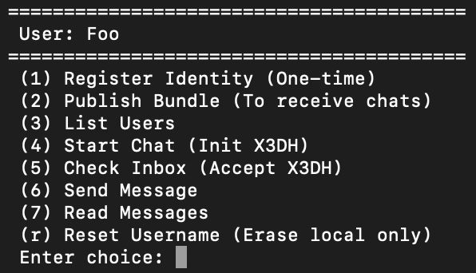
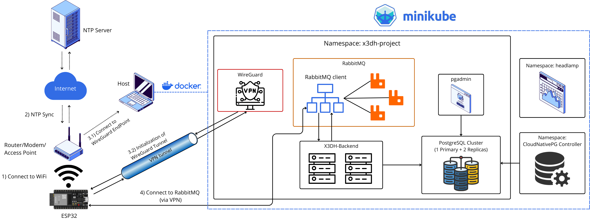

# X3DH implementation for ESP32
A demo with native C implementation of X3DH Key Agreement Protocol for ESP32.

This project demonstrates how to securely communicate ESP32 microcontrollers using the X3DH Key Agreement Protocol over **MQTTS**, leveraging a **VPN connection** established via WireGuard. The architecture consists of an `X3DH Server`, a `VPN Server`, a `RabbitMQ` message broker, and a `PostgreSQL` database, all orchestrated using `minikube` to create a local Kubernetes cluster.

## Specifications :desktop_computer:
`Host`'s specifications:
- OS: macOS 26.3
- Architecture: arm64
- CPU : Apple M2 (8)
- RAM : 8 GB
- Command Line Tools for Xcode: 26.2
- Python: 3.12.10 (at least 3.9)
- clang: 17.0.0
- cmake: 4.2.3 (at least 3.20)
- ninja: 1.13.2
- ccache: 4.12.3
- git: 2.53.0
- dfu-util: 0.11
- OpenSSL: 3.6.1
- Docker Desktop: 4.60.1
- minikube: 1.38.0
  - Kubernetes: 1.35.0
  - Docker: 29.2.0
  - containerd 2.2.1

`X3DH Server`'s specifications:
- OS: Alpine Linux 3.23.2
- Python: 3.13.11
- OpenSSL: 3.5.4

`VPN Server`'s specifications:
- OS: Alpine Linux 3.23.2
- WireGuard: 1.0.20250521

`RabbitMQ`'s specifications:
- OS: Alpine Linux 3.23.2
- RabbitMQ: 4.2.3 (at least 4.0.4)
- Erlang: 27.3.4.6
- OpenSSL: 3.5.4

`PostgreSQL`'s specifications:
- OS: Debian GNU/Linux 13.3
- postgres: 18.1

`ESP32`'s specifications:
- MCU module: ESP32-WROOM-32E
- Chip: ESP32-D0WD-V3 (revision v3.0)
- ESP-IDF: 5.5.1 (at least 5.3.0)
- gcc: 14.2.0
- cjson: 1.7.19
- libsodium: 1.0.20
- libxeddsa: 2.0.1
- MbedTLS: 3.6.4
- esp_wireguard: 0.9.0
- ESP-MQTT: 1.0.0

## macOS issues :sos:

If you are using `macOS`: 
1. make sure to update the Python certificates. To make it easier, I strongly suggest to download Python from the official website, instead of using HomeBrew/MacPorts, and then run the following commands in your terminal:

```bash
cd /Applications/Python\ 3.x/
./Install\ Certificates.command
```

2. if you cannot see the ESP32 serial port after connecting it via USB, you might need to install the appropriate drivers. You could try to install the [WCH34 driver](https://www.wch-ic.com/downloads/CH34XSER_MAC_ZIP.html) and follow the installation guide from the official [repository](https://github.com/WCHSoftGroup/ch34xser_macos), or you could try to install the [Silicon Labs CP210x driver](https://www.silabs.com/developers/usb-to-uart-bridge-vcp-drivers).

3. if you are using `minikube` with `docker` as driver, and you are facing this error _ERROR KubeletVersion_, you might need to execute this script: `minikube_down.sh`.

# How to build it 🛠️

```bash
git clone https://github.com/mastronardo/ESP32-X3DH-Demo.git
cd ESP32-X3DH-Demo && chmod +x create_cluster.sh gen_certs.sh
```

## Client
The first step is to set up the ESP-IDF environment. You can follow the official guide [here](https://docs.espressif.com/projects/esp-idf/en/latest/esp32/get-started/index.html).

### Component Registry
Now you can add the need components via ESP Component Registry. You can simply run the following commands to add the required dependencies for this project:

```bash
pip install -U pip # be sure to have the latest pip version
pip install -U idf-component-manager # be sure to keep the component Manager updated

idf.py add-dependency "espressif/libsodium^1.0.20~3"
idf.py add-dependency "espressif/cjson^1.7.19~1"
idf.py add-dependency "trombik/esp_wireguard^0.9.0"
idf.py add-dependency "espressif/mqtt^1.0.0"
```

Since [libxeddsa](https://github.com/Syndace/libxeddsa) library is not available in the Component Registry, it was necessary to manually build it for ESP-IDF.
The first step was to clone the repository inside the `components` directory.

```bash
mkdir -p client/components && cd client/components
git clone https://github.com/Syndace/libxeddsa.git
```

After that, the following files inside the `libxeddsa` directory were been modified to make the library compatible with ESP-IDF: `CMakeLists.txt`, `ref10/CMakeLists.txt`, `ref10/include/cross_platform.h`. In addition, some files that were not needed for this project (for example _tests_ and _docs_), were deleted to free some space in the flash memory.

### sdkconfig
`sdkconfig.defaults` was created to automatically generate the ready-to-use `sdkconfig` file when you open the `menuconfig` or _set the target_.
1. To make sure that the client binary executable file will fit inside the flash memory of the ESP32, and to avoid stack overflow issue when running the project, these parameters were set:
  - `(Top)` → `Partition Table` → `Partition Table` → `Two large size OTA partitions`
  - `(Top)` → `Serial Flasher Config` → `Flash size` → `4MB`
  - `(Top)` → `Component config` → `ESP System Settings` → `Main task stack size` → `12288`
  - `(Top)` → `Component config` → `LWIP` → `TCP/IP Task Stack Size` → `4096`
2. To enable the HKDF algorithm required by the X3DH Key Agreement Protocol and TLSv1.3:
  - `(Top)` → `Component config` → `mbedTLS` → `HKDF algorithm (RFC 5869)`
3. Since "_IPv6 support is alpha and probably broken_" in **esp_wireguard** component, it is recommended to disable it:
  - `(Top)` → `Component config` → `LWIP` → `Enable IPv6` _(disable)_
4. To enable the PPP support needed by the **esp_wireguard** component:
  - `(Top)` → `Component config` → `LWIP` → `Enable PPP support`
5. To enable MQTT 5.0 and disable MQTT 3.1.1:
  - `(Top)` → `Component config` → `ESP-MQTT Configurations` → `Enable MQTT protocol 5.0`
  - `(Top)` → `Component config` → `ESP-MQTT Configurations` → `Enable MQTT protocol 3.1.1` _(disable)_
6. To force using TLSv1.3:
  - `(Top)` → `Component config` → `mbedTLS` → `mbedTLS v3.x related` → `Support TLS 1.3 protocol`
  - `(Top)` → `Component config` → `mbedTLS` → `Support TLS 1.2 protocol` _(disable)_

### Erase flash memory
Since we are going to store the keys in the NVS memory, it is recommended to erase the flash:
1. before flashing the client for the first time,
2. or, if you want to execute the project from a clean state.

```bash
idf.py -p PORT erase-flash
```

### Binary file size
With ESP-IDF VS Code extension, you can easily check the size of the generated binary file after building the project. The following table shows the size of the different memory sections for the generated binary file:

| Flash Code | Flash Data | IRAM      | DRAM      | RTC SLOW |
|:----------:|:----------:|:---------:|:---------:|:---------:|
| 868KB      | 164KB      | 96KB/128KB|65KB/177KB | 0KB/8KB   |

## Minikube :whale:
Make sure to have `minikube` installed on your machine. You can follow the official guide [here](https://minikube.sigs.k8s.io/docs/start/). The choice to use **minikube** is influenced by the fact that is a lightweight K8s instance that can be easily set up on a local machine, making it ideal for development and testing purposes. It allows us to create a local Kubernetes cluster without the need for complex infrastructure, which is perfect for this demo.

The suggested Web UI is [Headlamp](https://github.com/kubernetes-sigs/headlamp), thanks to its user-friendly interface and powerful features for managing Kubernetes clusters. It provides an intuitive way to visualize and interact with the cluster resources, making it easier to monitor the status of the deployed components.

### X3DH Server
The X3DH server is implemented in Python and runs inside a lean Docker container. To build the Docker image, you need to pull the base image and then build the custom image using the provided `Dockerfile`. The server interacts with a PostgreSQL database to store user info and uses TLSv1.3 for secure communication with broker. The database password can be retrieved from the Kubernetes secret created during the cluster setup.

```bash
# do not use sudo if your user has permissions to run docker commands
sudo docker pull python:3.13.11-alpine3.23
sudo docker build -t x3dh-server:1.1 ./server
```

### VPN Configuration
The VPN server was integrated into the demo to provide a secure communication channel between the ESP32 clients and the RabbitMQ broker. By using WireGuard, we can ensure that all data transmitted between the clients and the broker is encrypted and protected from potential eavesdropping or tampering. The VPN server runs inside a lightweight Docker container based on Alpine Linux, which keeps the resource usage low. The WireGuard configuration is set up to allow multiple clients to connect securely, and the necessary keys are generated during the cluster setup.

Since the [esp_wireguard](https://github.com/trombik/esp_wireguard) repository is no longer maintained, if you try to use the component as it is, you are going to face issues with the newest versions of ESP-IDF. Mainly thanks to [issues](https://github.com/trombik/esp_wireguard/issues) opened during 2025, and [Kerem Erkan's post](https://keremerkan.net/posts/wireguard-mtu-fixes/) about MTU fixes, it was possible to make the component work again.

- **Overview:** the MCU performs NTP time synchronization and initializes the WireGuard tunnel. All runtime parameters used by the client are provided via the generated header `keys.h`.

- **Generate `keys.h`:** `generate_keys.py` extracts the required information from WireGuard and RabbitMQ containers, and writes them to `client/main/keys.h`. You need to provide two arguments: the **host's local IP address** where the Minikube cluster is running, and the **peer number** assigned in the WireGuard server configuration (starting from 1).

- **Preshared Key (PSK) compatibility:** the `esp_wireguard` client used does not support `PresharedKey`. For that reason the helper script `update_wg_config.sh` (embedded in `k8s-deployment.yaml`) comments out `PresharedKey` lines in the server configuration and replaces `PostUp`/`PostDown` rules to ensure proper forwarding/NAT and add an MSS clamp to avoid MTU issues. The script writes a flag file so it runs only once.

- **Runtime network notes:** `app_main.c` sets the WireGuard interface address from `WG_LOCAL_IP_ADDR` and, in the current code, forces a class-A netmask (`255.0.0.0`) and a gateway of `10.13.13.1`. The interface MTU is reduced to `1280` to prevent packet fragmentation/loss. If your network topology requires different netmask/gateway/MTU, update `keys.h` or modify `start_wireguard()` in `app_main.c` accordingly.

> :warning: **Known Issue:** Due to **CGNAT** (Carrier-Grade NAT) used by mobile hotspot, the client may not be able to reach the WireGuard server. If you experience connectivity issues, please try to connect the MCU to a different network.
  > If you are using a different client device (such as a PC), yet got the same issue, please check this [Kerem Erkan's post](https://keremerkan.net/posts/udp2raw-bypass-censoring-wireguard-protocol/).

> :no_entry: **Known Limitation:** **esp_wireguard** does not support _Ethernet interface_.

### RabbitMQ :rabbit:
The RabbitMQ message broker it is used to reduce the load on requests that were previously sent directly to the server, and to use a lighter protocol that is better suited to the IoT ecosystem (_MQTT_). The broker is configured to use TLSv1.3 for secure communication with both the server and the clients. The necessary certificates are generated during the cluster setup and mounted as Kubernetes secrets. Three replicas of RabbitMQ are deployed to ensure high availability, and a `ClusterIP` service is created to allow internal communication within the cluster.

## PostgreSQL :elephant:
The PostgreSQL database is used to store user information for the X3DH server. It is managed using [CloudNativePG Operator](https://github.com/cloudnative-pg/cloudnative-pg), which simplifies the deployment and management of PostgreSQL clusters (_1 primary instance + 2 replicas_) on Kubernetes. The choice of using PostgreSQL is due to its robustness and reliability, making it suitable for production environments.

A `pgAdmin` instance is also deployed to provide a web-based interface for managing the database. It is accessible via `localhost:30080` and can be used to verify that the database is correctly set up and to inspect the stored data.

# How to run the demo :rocket:
First of all, make sure to:
- set the target for your ESP32 device (e.g. `esp32` or `esp32s3`),
- use a valide WiFi credentials inside `client/main/app_main.c` file,
- set the number of peers for VPN Server inside `k8s-deployment.yaml`,
- update the Postgres env varibles inside `server/start.sh` and `server/server.py`,
- choose an email and a password for _pgAdmin_ inside `pgadmin.yaml`,
- retrieve the password to access the `x3dh_db` from _pgAdmin_ with:
```bash
kubectl get secret x3dh-db-cluster-app -n x3dh-project -o jsonpath='{.data.password}' | base64 -d
```

1. Start the Minikube cluster:
```bash
# Run this only the first time to create the cluster
./create_service.sh 
```

```bash
# Run this to start the cluster if you stopped it earlier
minikube start
```

2. Generate the `keys.h` file for the client:
```bash
python3 generate_keys.py <HOST_LOCAL_IP> <PEER_NUMBER>
```

3. Build, flash and monitor the client:
```bash
cd client && get_idf
idf.py build
idf.py -p PORT flash monitor
```

## Flow :infinity:
The `ESP32 client` will firstly connect to **WiFi**, then it will perform **NTP** time synchronization. After that, the **WireGuard tunnel** will be initialized to connect to the `VPN Server`, to securely communicate with `RabbitMQ broker`, ensuring end-to-end encryption and secure key exchange. The following menu will be displayed:

<p align="center">
  
</p>

# Schema
The following schema illustrates the architecture of the demo, showing how the different components interact with each other:

<p align="center">
  
</p>